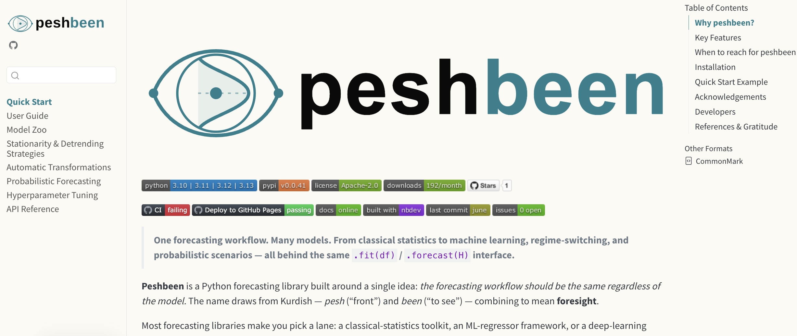



##

<br>
<br>

[Outline]{.mimic-h2}

:::{style="font-weight: bold; font-size: 1.3em; line-height: 1.8;"}
- [Problem & Motivation]{style="color: #20808D;"}
- [The Methodology]{style="color: #999;"}
- [Experimental Setup]{style="color: #999;"}
- [Empirical Results]{style="color: #999;"}
- [Next Steps]{style="color: #999;"}

:::

## The Clinical & Operational Problem

<br>

::::{.columns style="display: flex; align-items: center;"}
:::{.column width="48%"}

:::{style="font-size: 1.15em; line-height: 1.6; padding-right: 20px;"}
- **Interconnected Specialties:** Dozens of acute clinical services continuously share and compete for hospital bed capacity.

- **Ripple Effects & Bed Blocking:** Medical discharge delays directly block acute surgical transfers from recovery units.

- **Patient Off-Placement:** When target wards are full, patients are boarded in the "wrong" specialty beds—inflating length of stay and compounding hospital gridlock.
:::

:::

:::{.column width="52%"}
{width="100%" style="border-radius: 12px; box-shadow: 0 10px 30px rgba(0,0,0,0.15);"}
:::
::::

## The Scale of the Challenge

### Capturing system-wide dynamics across 58 interdependent time series

<br>

::::{.columns}
:::{.column width="33%" .fragment}
:::{.border-box style="background-color: #E8F4F5; text-align: center; padding: 35px 25px; border-radius: 12px; height: 100%;"}
[29]{style="font-size: 3em; font-weight: 800; color: #20808D; display: block;"}
[Clinical Specialties]{style="font-size: 1.4em; font-weight: 600; color: #091717; display: block; margin-top: 10px;"}
Medicine, Surgery, Trauma, Cardiology, Haematology, ICU, etc.
:::
:::

:::{.column width="33%" .fragment}
:::{.border-box style="background-color: #DEF7F9; text-align: center; padding: 35px 25px; border-radius: 12px; height: 100%;"}
[2 Flow Types]{style="font-size: 3em; font-weight: 800; color: #0B363C; display: block;"}
[Admissions & Discharges]{style="font-size: 1.4em; font-weight: 600; color: #091717; display: block; margin-top: 10px;"}
Coupled daily inflows and outflows
:::
:::

:::{.column width="33%" .fragment}
:::{.border-box style="background-color: #FDE8E8; text-align: center; padding: 35px 25px; border-radius: 12px; height: 100%;"}
[58 Series]{style="font-size: 3em; font-weight: 800; color: #BF505C; display: block;"}
[Simultaneous Time Series]{style="font-size: 1.4em; font-weight: 600; color: #091717; display: block; margin-top: 10px;"}
5 years of daily data ($>133,000$ hospital observations)
:::
:::
::::

<br>

:::{style="text-align: center; font-size: 1.35em; font-weight: 600; color: #0B363C; margin-top: 20px;" .fragment}
How should we forecast these 58 streams for next planning periods?
:::

## The Traditional Approach: 58 Univariate Forecasting Models


<br>

::::{.columns}
:::{.column width="50%" .fragment}
:::{.callout-warning icon="false"}
## Univariate Modeling
- Fit **58 separate forecasting models** (one per specialty and flow).
- Maintain and monitor model performance for each series independently.
  - For example, Hyperparameter tuning repeated for **58 independent times**.
- Each model conditioned exclusively on its **own past values**:
$$
\hat{y}_{t+1}^{(i)} = f_i\left(y_t^{(i)}, y_{t-1}^{(i)}, \dots, y_{t-p}^{(i)}, \mathbf{X}_t^{\text{calendar}}\right)
$$
:::
:::

:::{.column width="50%" .fragment}
:::{.callout-important icon="false"}

## Operational Realities

- **Information Interdependencies:** Admissions and discharges are strongly correlated across specialties ($r \approx 0.85-1.0$). Ignoring cross-specialty spillovers creates blind spots in operational planning.

- **Technical Debt & Scalability Issues:** Maintaining 58 separate models is resource-intensive and error-prone, especially when each model requires independent hyperparameter tuning and monitoring.

:::
:::
::::

<br>

:::{style="text-align: center; font-size: 1.3em; font-weight: bold; color: #20808D;" .fragment}
&#10140; What if we could train **ONE model** that forecasts **all 58 series at once**?
:::

## 

<br>
<br>

[Outline]{.mimic-h2}

:::{style="font-weight: bold; font-size: 1.3em; line-height: 1.8;"}
- [Problem & Motivation]{style="color: #999;"}
- [The Methodology]{style="color: #20808D;"}
- [Experimental Setup]{style="color: #999;"}
- [Empirical Results]{style="color: #999;"}
- [Next Steps]{style="color: #999;"}

:::

## Mathematical Formulation: Multi-Series Global Model

:::: {.columns}

::: {.column width="62%"}
::: {style="border-right: 1px solid #D2DFDF; padding-right: 25px;"}

- **Global Functional Mapping:**  
  Rather than fitting 58 single-series models, a single function $\mathcal{M}$ predicts discharge volume $y_{i,t}$:
  $$y_{i, t} = \mathcal{M}\left( s_i, \, \mathbf{X}_{t}^{\text{cross}}, \, \mathbf{Z}_{t} \right) + \epsilon_{i, t}, \qquad i = 1, \dots, N$$

- **Cross-Specialty Feature Vector:**  
  Captures systemic "ripple effects" by concatenating $p$ autoregressive lags across all $M$ clinical specialties:
  $$\mathbf{X}_{t}^{\text{cross}} = \left[\mathbf{y}_{t-1:t-p}^{(1)}, \, \mathbf{y}_{t-1:t-p}^{(2)}, \, \dots, \, \mathbf{y}_{t-1:t-p}^{(M)}\right] \in \mathbb{R}^{M \cdot p}$$

- **Pooled Empirical Risk Minimization:**  
  The global estimator $\mathcal{M}^*$ is learned jointly across all series and time points:
  $$\min_{\mathcal{M}} \sum_{i=1}^{N} \sum_{t=p+1}^{T} \mathcal{L}\left( y_{i, t}, \, \mathcal{M}\left(s_i, \, \mathbf{X}_{t}^{\text{cross}}, \, \mathbf{Z}_{t}\right) \right) + \Omega(\mathcal{M})$$

:::
:::

::: {.column width="38%"}
::: {style="padding-left: 20px; font-size: 0.95em; line-height: 1.55;"}

[**Notation & Dimensions:**]{style="color: #0B363C; font-size: 1.1em; font-weight: bold; display: block; margin-bottom: 8px;"}

- $y_{i,t}$: Discharge volume for series $i$ on day $t$
- $N$: Total target streams (29 specialties $\times$ 2 flow types)
- $s_i \in \{1, \dots, N\}$: Categorical series identifier
- $M$: Number of clinical specialties
- $p$: Autoregressive lag depth
- $\mathbf{Z}_t$: Exogenous covariates (calendar, holidays, capacity expansion)
- $\mathcal{M}(\cdot)$: Global non-linear learner (LightGBM GBDT)

:::
:::

::::

## The Multi-Series Training Matrix Architecture

<br>




## Recursive Multi-Step Ahead Forecasting ($H = 42$ Days)

### Propagating dynamic feedback loops across the forecasting horizon

<br>

::::{.columns}
:::{.column width="32%" .fragment}
:::{.border-box style="background: white; border: 2px solid #20808D; border-radius: 10px; padding: 20px; box-shadow: 0 4px 12px rgba(0,0,0,0.06); height: 100%;"}
[Step $h = 1$ (Known History)]{style="background: #20808D; color: white; padding: 6px 14px; border-radius: 6px; font-weight: bold; font-size: 1.1em; display: block; text-align: center; margin-bottom: 14px;"}

[1. Known Observations:]{style="font-weight: bold; color: #0B363C; font-size: 1.02em;"}
Model ingests historical observations up to time $t$:
$$\mathbf{X}_{t} = \left[\mathbf{y}_{t:t-6}^{(1)}, \dots, \mathbf{y}_{t:t-6}^{(29)}, \mathbf{Z}_{t+1}\right]$$

[2. Forecast Generation:]{style="font-weight: bold; color: #0B363C; font-size: 1.02em; margin-top: 10px; display: block;"}
$$\hat{\mathbf{y}}_{t+1} = \mathcal{M}\left(\mathbf{X}_t\right)$$
Generates 1-step ahead forecasts for **all 58 series simultaneously**.
:::
:::

:::{.column width="32%" .fragment}
:::{.border-box style="background: white; border: 2px solid #B2582D; border-radius: 10px; padding: 20px; box-shadow: 0 4px 12px rgba(0,0,0,0.06); height: 100%;"}
[Step $h = 2$ (AutoReg Roll)]{style="background: #B2582D; color: white; padding: 6px 14px; border-radius: 6px; font-weight: bold; font-size: 1.1em; display: block; text-align: center; margin-bottom: 14px;"}

[1. Lag Update Feedback:]{style="font-weight: bold; color: #B2582D; font-size: 1.02em;"}
Predicted values $\hat{\mathbf{y}}_{t+1}$ roll into the most recent lag position:
$$\text{Lag}_1 \leftarrow \hat{\mathbf{y}}_{t+1}, \quad \text{Lag}_2 \leftarrow \mathbf{y}_t$$

[2. Step-2 Prediction:]{style="font-weight: bold; color: #B2582D; font-size: 1.02em; margin-top: 10px; display: block;"}
$$\hat{\mathbf{y}}_{t+2} = \mathcal{M}\left(\mathbf{X}_{t+1}\right)$$
Generates 2-step ahead forecasts for **all 58 series simultaneously**.
Mutual cross-specialty dependencies feed directly into day 2.
:::
:::

:::{.column width="32%" .fragment}
:::{.border-box style="background: white; border: 2px solid #0B363C; border-radius: 10px; padding: 20px; box-shadow: 0 4px 12px rgba(0,0,0,0.06); height: 100%;"}
[Step $h = 3 \dots H$ ($H = 42$)]{style="background: #0B363C; color: white; padding: 6px 14px; border-radius: 6px; font-weight: bold; font-size: 1.1em; display: block; text-align: center; margin-bottom: 14px;"}

[1. Recursive Progression:]{style="font-weight: bold; color: #0B363C; font-size: 1.02em;"}
Repeated iteratively for all 42 days of the operational roster horizon.

[2. Full Joint Trajectory:]{style="font-weight: bold; color: #0B363C; font-size: 1.02em; margin-top: 10px; display: block;"}
Produces a coherent $42 \times 58$ matrix of forecasts:
$$\hat{\mathbf{Y}}_{t+1:t+42} \in \mathbb{R}^{42 \times 58}$$
:::
:::
::::


<!-- :::{style="background: #DEF7F9; padding: 14px 20px; border-radius: 8px; border-left: 4px solid #0B363C; font-size: 0.98em; line-height: 1.5;"}
**Operational Significance for Hospital Rostering:** Because an emergency admission surge today triggers surgical delays tomorrow and downstream medical discharges days later, this recursive multi-series architecture **dynamically simulates the ripple effect across specialties** over the operational 6-week scheduling horizon.
::: -->

## 

<br>
<br>

[Outline]{.mimic-h2}

:::{style="font-weight: bold; font-size: 1.3em; line-height: 1.8;"}
- [Problem & Motivation]{style="color: #999;"}
- [The Methodology]{style="color: #999;"}
- [Experimental Setup]{style="color: #20808D;"}
- [Empirical Results]{style="color: #999;"}
- [Next Steps]{style="color: #999;"}

:::

## Experimental Setup & Benchmarking {.smaller}


<br>

::::{.columns style="display: flex; align-items: stretch; gap: 20px;"}
:::{.column style="width: 50%; display: flex; flex-direction: column;" .fragment}
:::{.border-box style="background: white; border: 2px solid #0B363C; border-radius: 10px; padding: 18px 20px; box-shadow: 0 4px 12px rgba(0,0,0,0.06); flex: 1; display: flex; flex-direction: column;"}
[NHS Inpatient Dataset & Evaluation Protocol]{style="background: #0B363C; color: white; padding: 6px 14px; border-radius: 6px; font-weight: bold; font-size: 0.98em; display: block; text-align: center; margin-bottom: 14px;"}

:::{style="font-size: 0.95em; line-height: 1.55; flex: 1;"}
- **Data Source:** NHS Inpatient dataset (Jan 2021 – Feb 2026).

- **Target Dimensions:** 29 clinical specialties $\times$ 2 flow types $= \mathbf{58}$ time series.

- **Cross-Lag Features:** 29 dominant flow series $\times$ 7 lags $= \mathbf{203}$ dynamic features.

- **Exogenous Variables:** Calendar (`dow`, `month`), bank holidays, and General Medicine capacity expansion (`gm_ch`).

- **Rolling-Origin Cross-Validation:**
  - Reserve the last year of data for out-of-sample evaluation.
  - **30 rolling evaluation splits**, horizon **$H = 42$ days** (step $= 12$ days).
  - Primary metric: Root Mean Squared Scaled Error (**RMSSE**).
:::
:::
:::

:::{.column style="width: 50%; display: flex; flex-direction: column;" .fragment}
:::{.border-box style="background: white; border: 2px solid #20808D; border-radius: 10px; padding: 18px 20px; box-shadow: 0 4px 12px rgba(0,0,0,0.06); flex: 1; display: flex; flex-direction: column;"}
[Competing Models & Benchmarking Protocol]{style="background: #20808D; color: white; padding: 6px 14px; border-radius: 6px; font-weight: bold; font-size: 0.98em; display: block; text-align: center; margin-bottom: 14px;"}

:::{style="font-size: 0.95em; line-height: 1.55; flex: 1;"}
- **Model Families Evaluated:**
  - **LightGBM (`lgb`):** Fast histogram GBDT with native categorical series handling.
  - **XGBoost (`xgb`):** Level-wise gradient boosting with one-hot series encoding.
  - **Ridge Regression (`ridge`):** Linear $L_2$ regression with Fourier seasonality terms.

- **Single-Series Benchmark:**
  - **58 independent models** per family, tuned with **Optuna** and cross-validation on test data.

- **Multi-Series Model (Proposed):**
  - **1 unified model** per family, tuned with **Optuna** and cross-validation on test data.
:::
:::
:::
::::

## 

<br>
<br>

[Outline]{.mimic-h2}

:::{style="font-weight: bold; font-size: 1.3em; line-height: 1.8;"}
- [Problem & Motivation]{style="color: #999;"}
- [The Methodology]{style="color: #999;"}
- [Experimental Setup]{style="color: #999;"}
- [Empirical Results]{style="color: #20808D;"}
- [Next Steps]{style="color: #999;"}

:::

## Forecast Evaluation Metrics

### Assessing point accuracy and distributional calibration across heterogeneous streams

::::{.columns}
:::{.column width="50%"}
:::{.border-box style="background: white; border: 2px solid #0B363C; border-radius: 10px; padding: 14px 18px; box-shadow: 0 4px 12px rgba(0,0,0,0.06);"}
[Root Mean Squared Scaled Error (RMSSE)]{style="background: #0B363C; color: white; padding: 6px 14px; border-radius: 6px; font-weight: bold; font-size: 0.95em; display: block; text-align: center; margin-bottom: 12px;"}

$$\text{RMSSE} = \sqrt{\frac{\frac{1}{H}\sum_{h=1}^{H}\left(y_{t+h} - \hat{y}_{t+h}\right)^2}{\frac{1}{T-1}\sum_{t=2}^{T}\left(y_t - y_{t-1}\right)^2}}$$

:::{style="font-size: 0.92em; line-height: 1.45; margin-top: 10px;"}
- **Scale-Independent:** Discharges vary widely across series (e.g., 2 vs. 70 patients/day); errors are scaled by naïve random walk to enable fair multi-series comparison.
- **Outlier Penalty:** Quadratic loss penalizes large misforecasts during critical patient surges.
:::
:::
:::

:::{.column width="50%"}
:::{.border-box style="background: white; border: 2px solid #20808D; border-radius: 10px; padding: 14px 18px; box-shadow: 0 4px 12px rgba(0,0,0,0.06);"}
[Continuous Ranked Probability Skill Score (CRPSS)]{style="background: #20808D; color: white; padding: 6px 14px; border-radius: 6px; font-weight: bold; font-size: 0.95em; display: block; text-align: center; margin-bottom: 12px;"}

$$\text{CRPS}(F, y) = \int_{-\infty}^{\infty}\left(F(x) - \mathbf{1}(x \ge y)\right)^2 dx$$
$$\text{CRPSS} = 1 - \frac{\text{CRPS}_{\text{Multi}}}{\text{CRPS}_{\text{Single}}}$$

:::{style="font-size: 0.92em; line-height: 1.45; margin-top: 10px;"}
- **Continuous Ranked Probability Score (CRPS):** Evaluates sharpness and calibration across all quantiles (probabilistic analogue of MAE).
- **Relative Skill Gain (CRPSS):** Benchmarks multi-series against single-series models ($\text{CRPSS} > 0$ indicates percentage improvement).
:::
:::
:::
::::

## Point Forecast Results

```{python}
#| fig-width: 100%
#| fig-height: 100%
#| fig-align: center

import matplotlib.pyplot as plt
import seaborn as sns
import pandas as pd
import numpy as np

# Load benchmark results
df = pd.read_csv('tables/point_comparison.csv')

plt.rcParams['figure.facecolor'] = '#FBFAF4'
plt.rcParams['axes.facecolor'] = '#FBFAF4'
plt.rcParams['font.sans-serif'] = 'Helvetica'

fig, axes = plt.subplots(1, 2, figsize=(22, 10))

# --- PLOT 1: Bar Chart of Mean RMSSE ---
model_summary = df.groupby('model').agg(
    RMSSE_sing=('RMSSE_sing', 'mean'),
    RMSSE_multi=('RMSSE_multi', 'mean'),
    Imp=('improvement_pct', 'mean')
).loc[['lgb', 'xgb', 'ridge']]

x = np.arange(len(model_summary))
width = 0.32
ax = axes[0]
r1 = ax.bar(x - width/2, model_summary['RMSSE_sing'], width, label='Single-Series (Tuned per series)', color='#0B363C', alpha=0.92)
r2 = ax.bar(x + width/2, model_summary['RMSSE_multi'], width, label='Multi-Series (All at once)', color='#20808D', alpha=0.92)

ax.set_xticks(x)
ax.set_xticklabels(['LightGBM\n(LGB)', 'XGBoost\n(XGB)', 'Ridge\nRegression'], fontsize=18, fontweight='bold')
ax.set_ylabel('Mean RMSSE', fontsize=18, fontweight='bold')
ax.set_title('Single vs. Multi-Series Performance Across Models', fontsize=22, fontweight='bold', pad=15)
ax.legend(fontsize=20, loc='upper left')
ax.grid(axis='y', alpha=0.3)
ax.tick_params(labelsize=16)

# Set clean axis limits
ax.set_ylim(0, 1.05)

# Annotate values
for rects, col in [(r1, '#0B363C'), (r2, '#20808D')]:
    for r in rects:
        h = r.get_height()
        ax.annotate(f'{h:.3f}', xy=(r.get_x() + r.get_width()/2, h),
                    xytext=(0, 6), textcoords='offset points', ha='center', va='bottom',
                    fontsize=16, fontweight='bold', color=col)

# Annotate percentage delta cleanly
ax.annotate('Best Overall\n+7.01% Win', xy=(0 + width/2, 0.561), xytext=(-0.25, 0.76),
            arrowprops=dict(facecolor='#20808D', edgecolor='#20808D', shrink=0.08, width=2, headwidth=7),
            fontsize=15, fontweight='bold', color='#20808D',
            bbox=dict(boxstyle='round,pad=0.4', facecolor='#E8F7F8', edgecolor='#20808D', linewidth=1.5))

ax.annotate('Curse of Dim.\n-47.55% Drop', xy=(2 + width/2, 0.829), xytext=(1.5, 0.91),
            arrowprops=dict(facecolor='#BF505C', edgecolor='#BF505C', shrink=0.08, width=2, headwidth=7),
            fontsize=15, fontweight='bold', color='#BF505C',
            bbox=dict(boxstyle='round,pad=0.4', facecolor='#FDE8E8', edgecolor='#BF505C', linewidth=1.5))

# --- PLOT 2: Improvement Distribution ---
ax2 = axes[1]
colors = {'lgb': '#20808D', 'xgb': '#E69F00', 'ridge': '#BF505C'}
names = {'lgb': 'LightGBM: Mean +7.01% (55/58 improved)',
         'xgb': 'XGBoost: Mean -4.08% (13/58 improved)',
         'ridge': 'Ridge: Mean -47.55% (2/58 improved)'}

for m in ['lgb', 'xgb', 'ridge']:
    sub = df[df['model'] == m]['improvement_pct']
    sns.kdeplot(sub, ax=ax2, label=names[m], color=colors[m], fill=True, alpha=0.25, linewidth=3.5)

ax2.axvline(0, color='black', linestyle='--', linewidth=2, alpha=0.7, label='Zero Improvement Threshold')
ax2.set_xlim(-100, 35)
ax2.set_xlabel('Improvement % in RMSSE (Positive = Multi-Series Outperforms)', fontsize=18, fontweight='bold')
ax2.set_ylabel('Density', fontsize=18, fontweight='bold')
ax2.set_title('Distribution of Relative Forecast Accuracy Gains', fontsize=22, fontweight='bold', pad=15)
ax2.legend(fontsize=20, loc='upper left')
ax2.grid(True, alpha=0.3)
ax2.tick_params(labelsize=16)

plt.tight_layout()
plt.show()
```


---

## System-Wide Superiority: 94% of Inpatient Streams Improved

<br>

```{python}
#| fig-width: 100%
#| fig-height: 100%
#| fig-align: center

lgb_df = df[df['model'] == 'lgb'].copy()
lgb_df['flow_type'] = lgb_df['series'].apply(lambda s: 'Discharge' if s.startswith('dis_') else 'Admission')
lgb_df['clean_name'] = lgb_df['series'].apply(lambda s: s.replace('adm_', '').replace('dis_', '').replace('_', ' ').title())

# Sort top 18 improved series
top_improved = lgb_df.sort_values('improvement_pct', ascending=True).tail(18)

fig, ax = plt.subplots(figsize=(24, 9))

y_pos = np.arange(len(top_improved))
colors = ['#20808D' if f == 'Discharge' else '#0B363C' for f in top_improved['flow_type']]

bars = ax.barh(y_pos, top_improved['improvement_pct'], color=colors, height=0.65, alpha=0.9)

ax.set_yticks(y_pos)
ax.set_yticklabels([f"{name} ({ft[:3]})" for name, ft in zip(top_improved['clean_name'], top_improved['flow_type'])], fontsize=20, fontweight='bold')
ax.set_xlabel('Improvement in RMSSE over Individually Tuned Baseline (%)', fontsize=20, fontweight='bold')
ax.set_title('Top Specialties Gaining from Hospital-Wide Multi-Series Forecasting (LightGBM)', fontsize=24, fontweight='bold', pad=15)
ax.axvline(0, color='black', linewidth=1)
ax.grid(axis='x', alpha=0.3)
ax.tick_params(labelsize=16)

for bar in bars: # Annotate each bar with the improvement percentage
    w = bar.get_width()
    ax.annotate(f'+{w:.1f}%', xy=(w, bar.get_y() + bar.get_height()/2),
                xytext=(6, 0), textcoords='offset points', ha='left', va='center',
                fontsize=18, fontweight='bold', color='#0B363C')

# Custom Legend
from matplotlib.patches import Patch
legend_elements = [
    Patch(facecolor='#20808D', label='Discharge Series (Mean Gain: +7.83%, 28/29 Improved)'),
    Patch(facecolor='#0B363C', label='Admission Series (Mean Gain: +6.19%, 27/29 Improved)')
]
ax.legend(handles=legend_elements, fontsize=20, loc='lower right')

plt.tight_layout()
plt.show()
```


---

## Probabilistic Forecast Results

<br>

```{python}
#| fig-width: 100%
#| fig-height: 100%
#| fig-align: center

import matplotlib.pyplot as plt
import seaborn as sns
import pandas as pd
import numpy as np
from matplotlib.patches import Patch

# Load probabilistic scores (PSCORE = CRPS over 30 CV test sets)
crps_raw = pd.read_csv('tables/pscore_summary.csv')

# Mean CRPS across 30 CV folds for each combination
mean_crps = crps_raw.groupby(['model', 'method', 'horizon_range', 'specialty'])['pscore'].mean().reset_index()
crps_piv = mean_crps.pivot(index=['model', 'horizon_range', 'specialty'], columns='method', values='pscore').reset_index()

# Continuous Ranked Probability Skill Score (CRPSS %: positive = multi-series outperforms univariate)
crps_piv['CRPSS'] = (1 - crps_piv['Multi'] / crps_piv['Single']) * 100

horizon_order = ['1-7', '8-14', '15-21', '22-42']
horizon_labels = ['Days 1–7\n(Immediate)', 'Days 8–14\n(Week 2)', 'Days 15–21\n(Week 3)', 'Days 22–42\n(Weeks 4–6)']

plt.rcParams['figure.facecolor'] = '#FBFAF4'
plt.rcParams['axes.facecolor'] = '#FBFAF4'
plt.rcParams['font.sans-serif'] = 'Helvetica'

fig, axes = plt.subplots(1, 2, figsize=(24, 8))

# --- PANEL 1: Model Comparison by Horizon ---
ax1 = axes[0]
models = ['lgb', 'xgb', 'ridge']
m_labels = {'lgb': 'LightGBM (Multi-Series)', 'xgb': 'XGBoost', 'ridge': 'Ridge Regression'}
m_colors = {'lgb': '#20808D', 'xgb': '#E69F00', 'ridge': '#BF505C'}

x = np.arange(len(horizon_order))
width = 0.26

for idx, m in enumerate(models):
    sub = crps_piv[crps_piv['model'] == m]
    means = [sub[sub['horizon_range'] == h]['CRPSS'].mean() for h in horizon_order]
    bars = ax1.bar(x + (idx - 1)*width, means, width, label=m_labels[m], color=m_colors[m], alpha=0.92)
    for b in bars:
        h = b.get_height()
        va = 'bottom' if h >= 0 else 'top'
        ax1.annotate(f'{h:+.1f}%', xy=(b.get_x() + b.get_width()/2, h),
                     xytext=(0, 5 if h>=0 else -14), textcoords='offset points',
                     ha='center', va=va, fontsize=13, fontweight='bold',
                     color=m_colors[m])

ax1.axhline(0, color='black', linestyle='--', linewidth=1.5, alpha=0.7)
ax1.set_xticks(x)
ax1.set_xticklabels(horizon_labels, fontsize=18, fontweight='bold')
ax1.set_ylabel('Mean CRPSS Skill Score (%)\n(Positive = Multi-Series Outperforms Univariate)', fontsize=18, fontweight='bold')
ax1.set_title('Probabilistic Skill Score (CRPSS) across Planning Horizons', fontsize=22, fontweight='bold', pad=14)
ax1.set_ylim(-55, 23)
ax1.set_xlabel('')
ax1.legend(fontsize=13, loc='lower right', framealpha=0.9)
ax1.grid(axis='y', alpha=0.3)
ax1.tick_params(labelsize=14)

ax1.text(0.03, 0.95, 'LightGBM Multi-Series: Sustained +4.7% to +7.7% gain across all horizons\nXGBoost fails to benefit (-1.6% to -3.6%) | Ridge collapses (-36% to -47%)',
         transform=ax1.transAxes, fontsize=16, fontweight='bold', va='top', color='#0B363C',
         bbox=dict(boxstyle='round,pad=0.4', facecolor='#E8F7F8', edgecolor='#20808D', alpha=0.95))

# --- PANEL 2: Distribution Across All 58 Streams (LightGBM) ---
ax2 = axes[1]
lgb = crps_piv[crps_piv['model'] == 'lgb'].copy()
lgb['flow_type'] = lgb['specialty'].apply(lambda s: 'Discharge' if s.startswith('dis_') else 'Admission')

sns.boxplot(data=lgb, x='horizon_range', y='CRPSS', ax=ax2, order=horizon_order,
            color='#E8F7F8', boxprops=dict(edgecolor='#0B363C', linewidth=1.5),
            medianprops=dict(color='#B2582D', linewidth=2.5), whiskerprops=dict(color='#0B363C'),
            capprops=dict(color='#0B363C'), width=0.45)

sns.stripplot(data=lgb, x='horizon_range', y='CRPSS', hue='flow_type', ax=ax2, order=horizon_order,
              palette={'Discharge': '#20808D', 'Admission': '#0B363C'}, alpha=0.75, size=8, jitter=0.22)

ax2.axhline(0, color='black', linestyle='--', linewidth=1.5, alpha=0.7)
ax2.set_xticks(range(len(horizon_order)))
ax2.set_xticklabels(horizon_labels, fontsize=18, fontweight='bold')
ax2.set_ylabel('LightGBM CRPSS Skill Score (%) per Stream', fontsize=18, fontweight='bold')
ax2.set_title('Distribution of Probabilistic Gains Across 58 Clinical Streams (LightGBM)', fontsize=22, fontweight='bold', pad=14)
ax2.grid(axis='y', alpha=0.3)
ax2.tick_params(labelsize=14)
ax2.set_ylim(-10, 36)
ax2.set_xlabel('')

pct_pos = [(lgb[lgb['horizon_range'] == h]['CRPSS'] > 0).mean()*100 for h in horizon_order]
for idx, p in enumerate(pct_pos):
    ax2.annotate(f'{p:.0f}% Streams\nImproved', xy=(idx, 32.5), ha='center', fontsize=16,
                 fontweight='bold', color='#0B363C',
                 bbox=dict(boxstyle='round,pad=0.3', facecolor='#FBFAF4', edgecolor='#20808D', alpha=0.9))

ax2.annotate('Clinical Haematology (+27.8%)', xy=(0, 27.8), xytext=(0.15, 29.5),
             arrowprops=dict(arrowstyle='->', color='#20808D', lw=1.5),
             fontsize=16, fontweight='bold', color='#20808D')
ax2.annotate('Ophthalmology (+25.2%)', xy=(3, 25.2), xytext=(2.15, 28.5),
             arrowprops=dict(arrowstyle='->', color='#20808D', lw=1.5),
             fontsize=16, fontweight='bold', color='#20808D')

legend_elements = [
    Patch(facecolor='#20808D', label='Discharge Streams: 100% (29/29) Improved (Mean +7.8%)'),
    Patch(facecolor='#0B363C', label='Admission Streams: 79.3% (23/29) Improved (Mean +5.4%)')
]
ax2.legend(handles=legend_elements, fontsize=16, loc='lower left', framealpha=0.9)

plt.tight_layout()
plt.show()
```


---

## System-Wide Probabilistic Calibration

```{python}
#| fig-width: 100%
#| fig-height: 100%
#| fig-align: center

fig2, axes2 = plt.subplots(1, 2, figsize=(24, 9.0))
lgb_clean = lgb.copy()
lgb_clean['clean_name'] = lgb_clean['specialty'].apply(lambda s: s.replace('adm_', '').replace('dis_', '').replace('_', ' ').title())

for idx, ft in enumerate(['Discharge', 'Admission']):
    ax = axes2[idx]
    sub = lgb_clean[lgb_clean['flow_type'] == ft].pivot(index='clean_name', columns='horizon_range', values='CRPSS')[['1-7', '8-14', '15-21', '22-42']]
    sub['Mean'] = sub.mean(axis=1)
    sub = sub.sort_values('Mean', ascending=False)
    
    cmap = sns.diverging_palette(10, 185, s=85, l=45, as_cmap=True)
    sns.heatmap(sub, ax=ax, cmap=cmap, center=0, annot=True, fmt='.1f',
                cbar_kws={'label': 'CRPSS (%)'}, linewidths=0.4, annot_kws={'size': 9, 'weight': 'bold'},
                vmin=-10, vmax=25)
    
    win_count = (sub['Mean'] > 0).sum()
    ax.set_title(f'{ft} Streams (LightGBM CRPSS %)\n{win_count}/29 Positive ({win_count/29*100:.1f}%) | Mean CRPSS: +{sub["Mean"].mean():.1f}%',
                 fontsize=20, fontweight='bold', pad=12)
    ax.set_xlabel('Forecasting Horizon Range', fontsize=13, fontweight='bold')
    ax.set_ylabel('Clinical Specialty' if idx == 0 else '', fontsize=13, fontweight='bold')
    ax.set_xticklabels(['Days 1–7', 'Days 8–14', 'Days 15–21', 'Days 22–42', 'Mean (1–42)'], fontsize=12, fontweight='bold')
    ax.tick_params(axis='y', labelsize=9.5)

plt.tight_layout()
plt.show()
```

## 1 Model vs. 58 Models

<br>

| Operational Dimension | Single-Series Models | Proposed Multi-Series | Operational Benefit |
| :--- | :--- | :--- | :--- |
| **Model Footprint** | **58 separate models** | **1 unified model** | [**Single model to maintain**]{style="color: #20808D; font-weight: bold;"} |
| **Hyperparameter Tuning** | 58 Optuna studies ($4,350$ CV fits) | 1 Optuna study ($75$ CV fits) | [**Substantially faster tuning process**]{style="color: #20808D; font-weight: bold;"} |
| **Data Utilization** | $58 \times 2,300$ observations | $133,000+$ collective panel rows | [**Greater statistical power**]{style="color: #20808D; font-weight: bold;"} |
| **Drift Monitoring** | 58 separate pipelines to track | 1 consolidated pipeline | [**Minimal maintenance overhead**]{style="color: #20808D; font-weight: bold;"} |
| **Cross-Specialty Awareness** | Limited to own series history | Full cross-series lag visibility | [**Captures inter-specialty spillover**]{style="color: #20808D; font-weight: bold;"} |
| **Forecast Accuracy** | Mean RMSSE: 0.5989 | **Mean RMSSE: 0.5610** | [**+7.01% average gain across 58 series**]{style="color: #20808D; font-weight: bold;"} |

## 

<br>
<br>

[Outline]{.mimic-h2}

:::{style="font-weight: bold; font-size: 1.3em; line-height: 1.8;"}
- [Problem & Motivation]{style="color: #999;"}
- [The Methodology]{style="color: #999;"}
- [Experimental Setup]{style="color: #999;"}
- [Empirical Results]{style="color: #999;"}
- [Next Steps]{style="color: #20808D;"}
:::

## Next Steps

### From well-calibrated probabilistic forecasts to stochastic bed allocation

<br>

::: {style="font-size: 1.25em; line-height: 1.8;"}

- **Probabilistic Scenarios:** Generate joint scenario paths across all specialties to capture uncertainty and cross-specialty admission&discharge surges.

- **Stochastic Optimization and Bed Reservation:** Formulate stochastic programming models for dynamic bed reservation under uncertainty to reduce patient off-placement.

:::


## [pesh]{style="color: #091717;"}[been]{style="color: #20808D;"}

- A Probabilistic Forecasting Package
- Open-source Python package implementing various forecasting frameworks(e.g., any sklearn-compatible regressor, ARIMA, ETS, etc.) for univariate and multi-series time series forecasting.

::::{.columns style="align-items: center;"}
::: {.column width="65%"}
<br>

{width="100%" fig-align="center"}
:::


::: {.column width="35%"}

<br>

<!-- [Open-source Python package implementing the AR-MSR forecasting framework]{style="font-size: 1.1em;"} -->


{width="55%" fig-align="center"}

[Scan for documentation]{style="display: block; text-align: center; font-weight: bold; color: #1A6872;"}

[mustafaslancoto.github.io/peshbeen](https://mustafaslancoto.github.io/peshbeen/){style="display: block; text-align: center; font-size: 0.8em;"}
:::
::::

# Any questions or thoughts? 💬

{fig-align="center"}