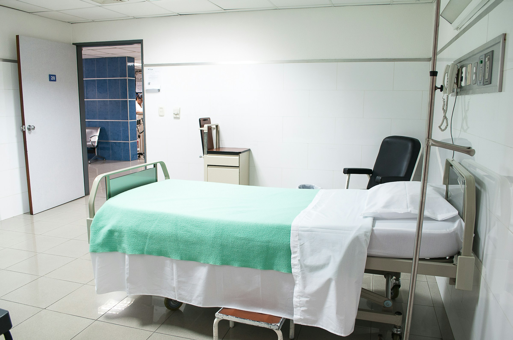

{fig-align="center"}

<link rel="stylesheet" href="https://cdnjs.cloudflare.com/ajax/libs/font-awesome/6.4.0/css/all.min.css">

[<i class="fas fa-bookmark"></i> Slides](../kurdish_aademic_conf/present.qmd){.btn .btn-sm .btn-outline-primary}

**Date:** Oct 7 2026 13:00-17:00 \
**Event:** Kurdish Annual Conference 2026\
**Location:** University of South Wales, Cardiff UK

## Context

In this talk, I will briefly talk about my journey in UK and what I am doing in my PhD research.