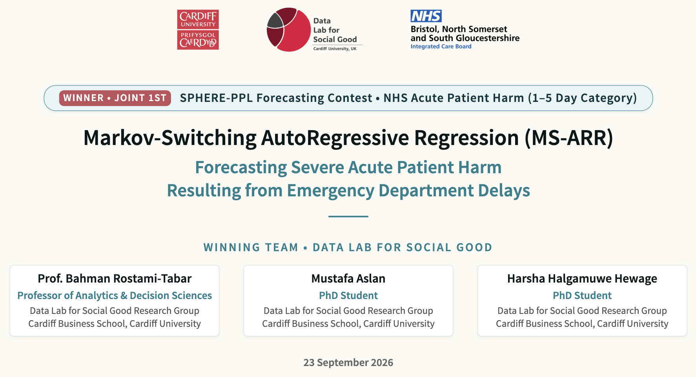

{fig-align="center"}

<link rel="stylesheet" href="https://cdnjs.cloudflare.com/ajax/libs/font-awesome/6.4.0/css/all.min.css">

[<i class="fas fa-bookmark"></i> Slides](../sphere/present.qmd){.btn .btn-sm .btn-outline-primary}

**Date:** September 23 2026 14:45 \
**Event:** NHS SPHERE-PPL Forecasting Contest \
**Organizer:** NHS Bristol, North Somerset and South Gloucestershire ICB

## Context

In this presentation, I shared our joint 1st-place winning solution for the **NHS SPHERE-PPL Forecasting Contest** (1–5 Day Horizon Category), developed by our team at the **Data Lab for Social Good** (Cardiff University). 

We tackled the challenge of forecasting daily **Estimated Avoidable Deaths (EAD)**—a critical outcome metric measuring acute patient mortality risk caused by prolonged emergency department (ED) delays awaiting inpatient beds. Standard linear and single-regime models fail because hospital operations experience extreme regime shifts and severe heteroskedasticity explosion in error variance during operational crisis states.

To address this, we developed a **Markov-Switching AutoRegressive Regression (MS-ARR)** model. By coupling regime-switching filters and the Forward-Backward algorithm, the framework captures persistent crisis lock-in, tracks daily regime escalation risks, and delivers actionable reliable forecasts for NHS trust capacity planning and clinical bed management.

