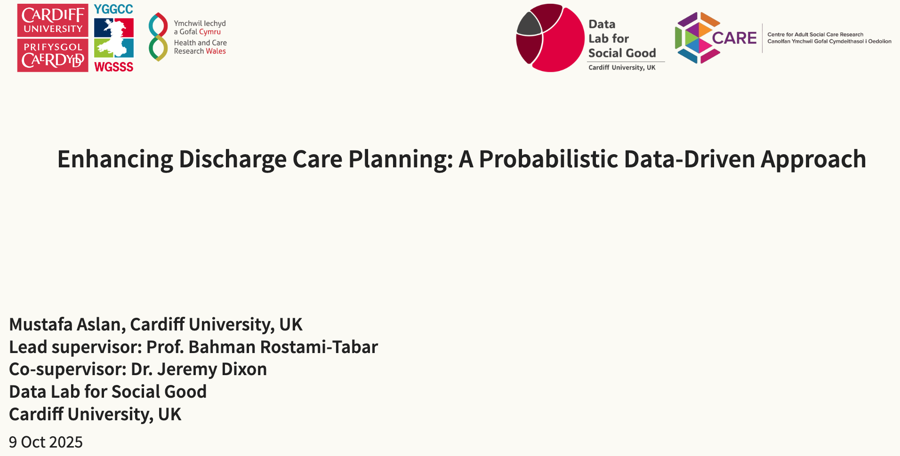

{fig-align="center"}

<link rel="stylesheet" href="https://cdnjs.cloudflare.com/ajax/libs/font-awesome/6.4.0/css/all.min.css">

[<i class="fas fa-bookmark"></i> Slides](../sword2026/causp_slide.html){.btn .btn-sm .btn-outline-primary}

**Date:** Oct 14 2026 18:15 PM\
**Event:** SWORD network event\
**Location:** School of Mathematics, Cardiff University, UK

## Context

At the [`SWORD Network Event`](https://www.theorsociety.com/ORS/Community/Regionals-List/South-Wales-OR-Network.aspx), we will present our PhD research on enhancing discharge care planning using a probabilistic data-driven approach. This research is designed to capture the dynamic and often unpredictable nature of patient flow and resource utilization in healthcare settings.