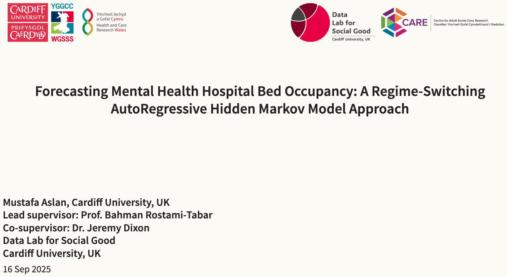

{fig-align="center"}

<link rel="stylesheet" href="https://cdnjs.cloudflare.com/ajax/libs/font-awesome/6.4.0/css/all.min.css">

[<i class="fas fa-bookmark"></i> Slides](../wgsss/slides.qmd){.btn .btn-sm .btn-outline-primary}

**Date:** Sep 16 2025 11:00 AM – 13:00 PM\
**Event:** 5th Welsh Postgraduate Research Cluster Workshop\
**Location:** School of Management, Swansea University, UK

At the `5th Welsh Postgraduate Research Cluster Workshop`, we will present our research on forecasting hospital bed occupancy using a Regime Switching Autoregressive Hidden Markov Model (RS-ARHMM). This model is designed to capture the dynamic and often unpredictable nature of hospital bed occupancy, which is influenced by various factors that are even not directly observable.

Hospital bed occupancy is a critical metric for healthcare systems, directly impacting patient care quality and operational efficiency. Accurate forecasting of bed occupancy can aid in resource allocation, staffing, and overall hospital management. The presentation introduces a Regime Switching Autoregressive Hidden Markov Model (RS-ARHMM) to forecast hospital bed occupancy, capturing the dynamic nature of healthcare demand. The RS-ARHMM model combines the strengths of autoregressive models in handling time series data with the flexibility of Markov switching to account for regime changes in occupancy patterns. The model is applied to historical bed occupancy data from a hospital, demonstrating its ability to adapt to sudden changes in demand, such as seasonal variations and unexpected surges. Results indicate that the RS-ARHMM model outperforms both traditional and modern forecasting methods, providing more accurate and reliable predictions in terms of probabilistic forecasting methods. This approach offers a valuable tool for hospital administrators and policymakers to enhance staffing strategies and resource management, ultimately improving patient outcomes and operational efficiency.